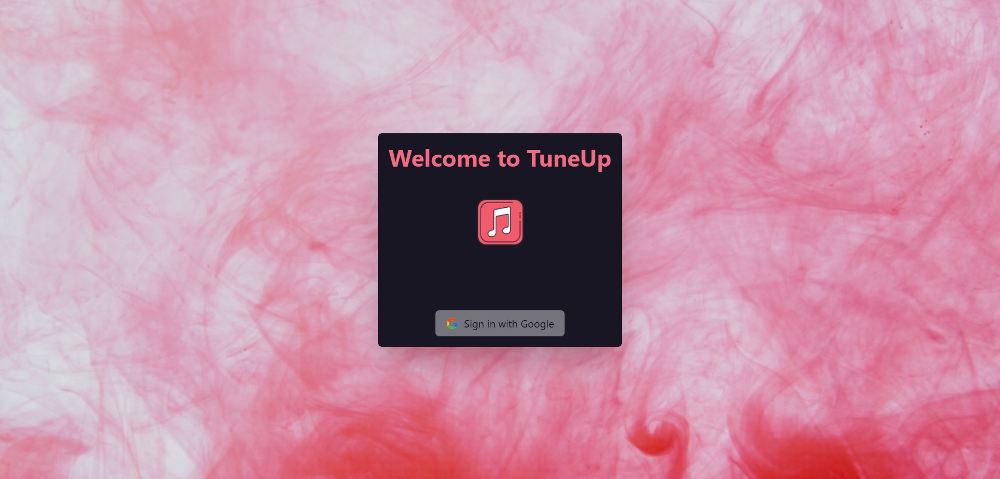
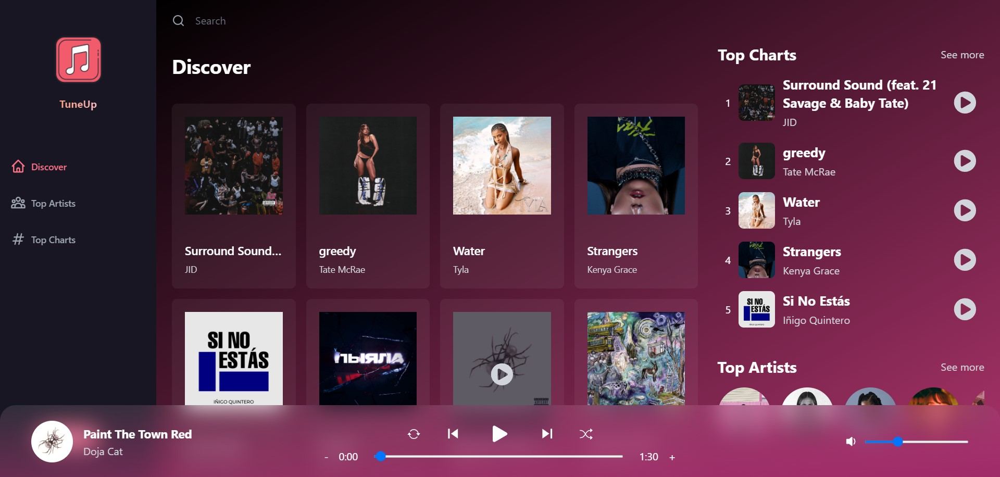
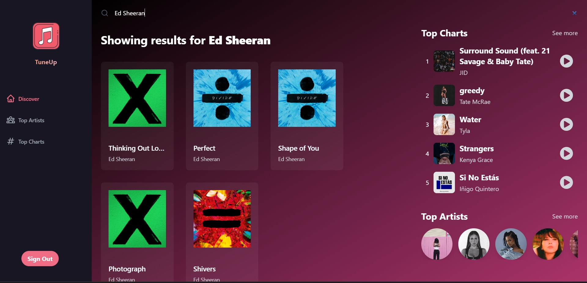

# TuneUp 🎵
TuneUp is a user-friendly online music player that elevates your auditory experience. Discover, stream, and enjoy your favorite tunes effortlessly with a sleek interface. TuneUp personalizes your music journey, adapting to your taste and keeping you in the loop with the latest releases.

## Technology
This project uses:

- React.js
- Redux
- Node.js
- Firebase
- JavaScript
- Tailwind CSS

## Running the project

To run the project, please follow these steps:
1. Install Node.js on your computer using this link
   ```js
   https://nodejs.org/
   ```
2. Clone the github project on the terminal
   ```js
   git clone https://github.com/Nguyen2705/TuneUp.git

3. Open new terminal and run the following commands.
   ```sh
   cd TuneUp
   npm install 
   npm run dev

4. Enjoy the music !!!


## Login Page



## Home Page



## Search Page

